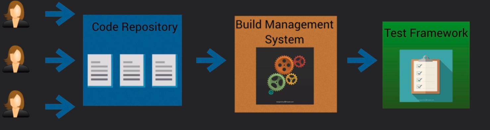
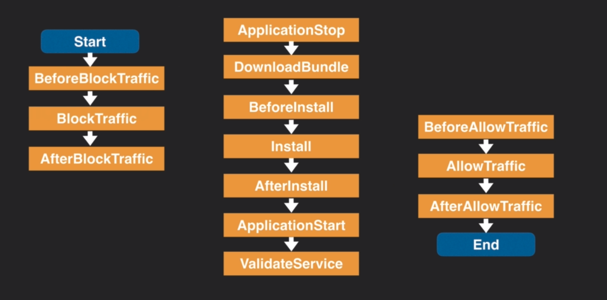

# Continuous Integration/Delivery #

CI/CD are ***Best Practices*** for software development. CI/CD allow more frequent updates to systems in an automated fashion.



- Test system runs automated tests
- Frequent small code changes emphasized

## Continuous Delivery vs Continuous Deployment ##

### Continuous Delivery ###

A workflow by which commits are built, tested, and prepared for release at a particular stage ( staging or production ). The release of the code is usually a manual decision/process.

### Continuous Deployment ###

Same steps as continuous delivery except code is automatically deployed at the end of the pipeline. Process is fully automated. Small changes are deployed frequently.

## Appspec file ##

### Lambda ###

YAML or JSON file that determines the parameters of CodeDeploy. The appspec file contains the following fields:

- version: Reserved for future use. 0.0 is the only allowed value
- resources: The name and properties of the Lambda function
- hooks: Lambda functions that run at specific points in the deployment lifecycle

appspec.yaml

```
version: 0.0 # Will be 0.0 until further notice
resources:
 -myLambdaFunction:
    Type: AWS::Lambda::Function
    Properties:
      Name: "myLambdaFunction"
      Alias: "myLambdaFunctionAlias"
      CurrentVersion: "1"
      TargetVersion: "2"
hooks:
  -BeforeAllowTraffic: "LambdaFunctionToValidateBeforeTraffic"
  -AfterAllowTraffic: "LambdaFunctionToValidateAfterTraffic"

```

- BeforeAllowTraffic: Specify tasks or functions you want to run before live traffic is routed to the Lambda function
- AfterAllowTraffic: Specify tasks or functions you want to run after live traffic is routes to the Lambda Function

### EC2 ###

The appspec.yml file must be placed in the **root** of your application code.

- version: ( same as above )
- os: Operating System
- files: source and destination of files
- hooks: Lifecycle event hooks that allow *scripts* to be run at specific points

```
version: 0.0
os: linux
files:
  -source: Config/config.txt
  destination: /webapps/Config

  -source: Source
  destination: /webapps/myApp
hooks:
  BeforeInstall:
    -location: Scripts/UnzipResourceBundle.sh
    -location: Scripts/UnzipDataBundle.sh
  AfterInstall:
    -location: Scripts/RunResourceTests.sh
    timeout: 180
  ApplicationStart:
    -location: Scripts/RunFunctionalTests.sh
    timeout: 3600
  ValidateService:
    -location: Scripts/MonitorService.sh
    timeout: 3600
    runas: codedeployuser
```

*Run order of hooks*


