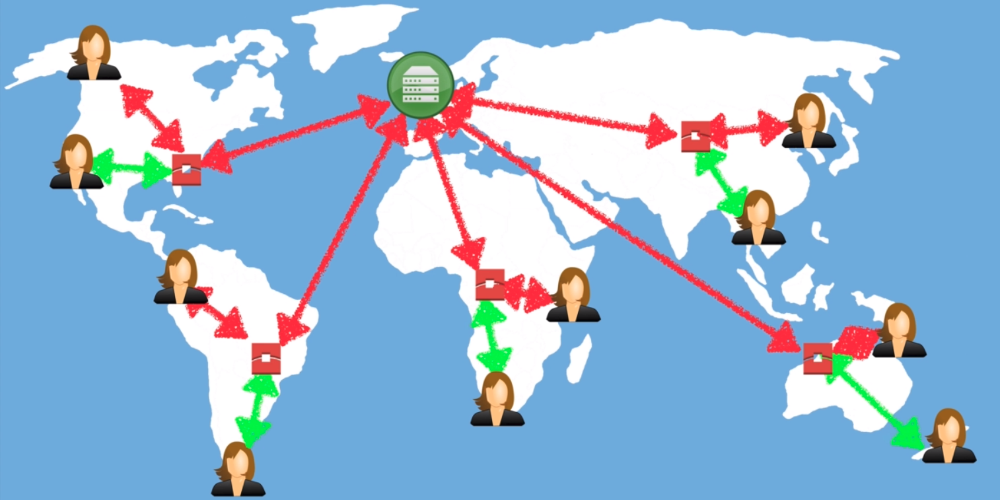

# Cloudfront #

Content Delivery Network service. Distributed network of servers used to deliver web content to end-users ( or edge zones ) to geographical regions.

Users make requests to localized servers called edge locations which cache resources instead of the main server. Network hops dramatically reduce, lowering latency. Objects are cached for a period called TTL.

## Terminology ##

- Edge Location - Location in which resources are cached.
- Origin - The server from which all file delivered by CDN originate
    - Usually EC2 or S3
    - Could be ELB, Route53 as well
- Distribution
    - The name given to the CDN
    - Comprised of Edge Locations
    - Web Distribution
        - Web Sites
        - Cannot serve Flash
    - RTMP ( Real Time Message Protocol )
        - Media Streaming

Can be used to deliver dynamic, static, streaming, and interactive content. Requests are automatically routed to the nearest edge location. Can be used to optimize S3 site for example.

Optimized to work with S3, EC2, ELB, and Route53 as well as non-AWS origin servers. Cloudfront over S3 Transfer Acceleration provides faster long-distance file transfers at an additional cost. Data is routed to S3 from an optimized network path.p

## Exam Tips ##

- Edge Location
- Origin
- Distribution
- Distribution Types
- **Not** Read-only
- Objects cached for Time to Live value
- Charge for manually clearing cache
