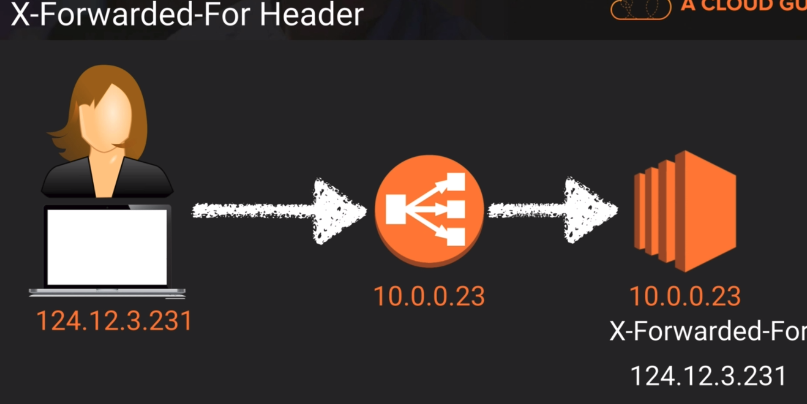

# ELB - Elastic Load Balancer #

Distribute load/traffic evenly between instances.

## Load Balancer Types ##

* Application Load Balancer
    * OSI Layer 7 ( application )
    * Advanced/Smart balancing
* Network Load Balancer
    * OSI Layer 3/4
    * ***Most expensive***
    * Capable of handling massive traffic
* Classic Load Balancer
    * ***Legacy***

## Exam Tips ##

A 504 Gateway error means the actual application is failing, not the load balancer.

If you need the IPv4 address of the end user, you can use the value of the X-Forwarded-For header.

-------------------------------------------------------------------------------

# Route 53 #

AWS DNS service. Maps domain names to services.

Zone Apex/Naked Domain - domain name without the "www"
