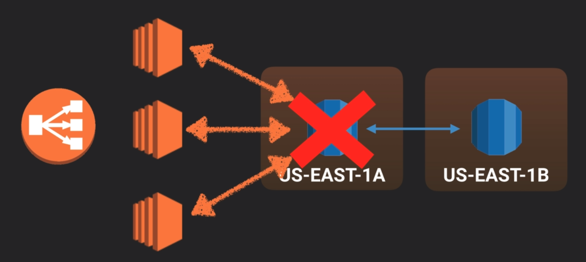
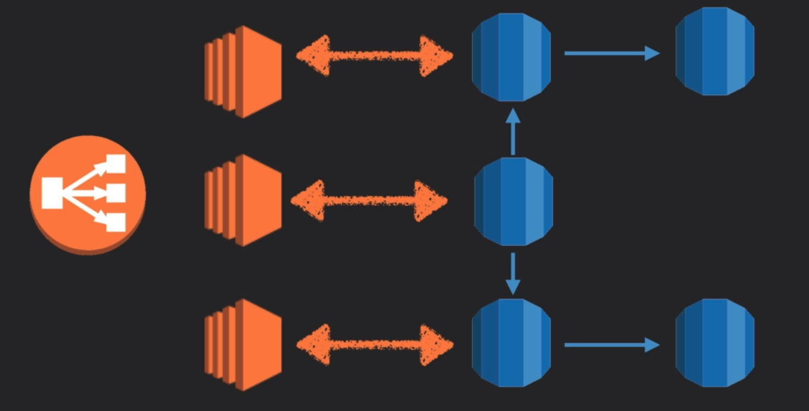

# RDS - Relational Database Service 101 #

AWS Relational database instances. Includes SQLServer, Oracle, MySQL, PostgreSQL, Aurora, and MariaDB.

## Backups ##

* Automatic Backups
    * Automated full daily snapshot
        * Instance may experience latency delays during backup
    * Stored in S3
        * Backup storage free up to size of instance ( e.g 10GB instance = 10GB backup storage )
    * Enabled by **default**
    * Can choose "Retention Period" of snapshots ( 1-35 days )
    * Point in time recover down to the second
* Database Snapshots
    * Manual
    * Persist after instance destroyed

Restoring from a backup creates a ***NEW*** RDS instance with a new DNS endpoint.

## Features ##

* Encryption
    * Encryption at rest provided via KMS
    * Encryption applies to backups, restores, read replicas etc..
    * ***Must*** encrypt when intially creating instance. In order to encrypt an existing database, you need to make a copy from a database snapshot, which creates a new instance.

* Multi-AZ ( Availability Zone )
    * Exact production copy in separate AZ
    * Automatic replication
    * Automatic failover
    * For ***disaster recovery*** only, not performance

* Read Replicas
    * ***READ-ONLY*** copy using asynchronous replication
    * Must have automatic backups enabled
    * Up to 5 replicas of a DB
    * Replicas of replicas may experience latency slowdown
    * Multi-AZ/Region replicas possible
    * Can be promoted to own Database
        * **Note** This will break replication

*All read replicas have their own private endpoints*
