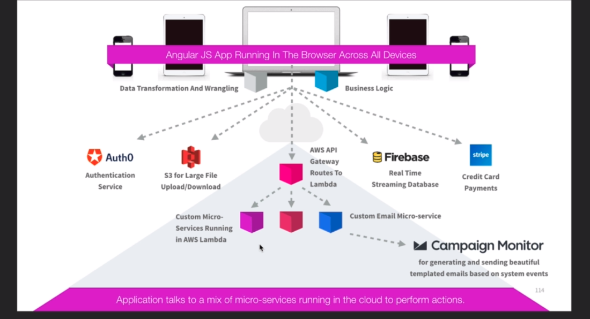

# Serverless 101 #

Allows code to be run without the need for provisioning and managing infrastructure.

The above runs on **No EC2 Instances**. Automatic scaling at extremely cost effective rates.

## Lambda ##

AWS Service that abstracts virtually all underlying infrastructure considerations such as OS, Hardware, Programming language etc... Allowing developers to run code in a serverless environment.

Developers upload code to create a Lambda function. AWS handles provisioning and managing the machines automatically.

- Event-Driven
    - Lambda functions that run in response to events
    - Changes in S3
    - Modification of DynamoDB table
- Compute Service
    - Can run code in response to HTTP requests
    - Run function in response to API calls w/ AWS SDKs

Supports:

- Node.js
- Java
- C#
- Go

## Pricing ##

- Number of requests ( per month )
    - First 1 million requests free
    - $0.20 per 1 million requests after
- Duration
    - Calculated from the time begins until it returns
    - $0.00001667 per GB-second used of memory

## Exam Tips ##

- Scales out, but not up automatically
- Lambda functions are independent ( 1 event = 1 function )
- Serverless
- Lambda functions can trigger other functions
- AWS X-ray can be used to debug Lambda
- Can be used globally
- Lambda Triggers
